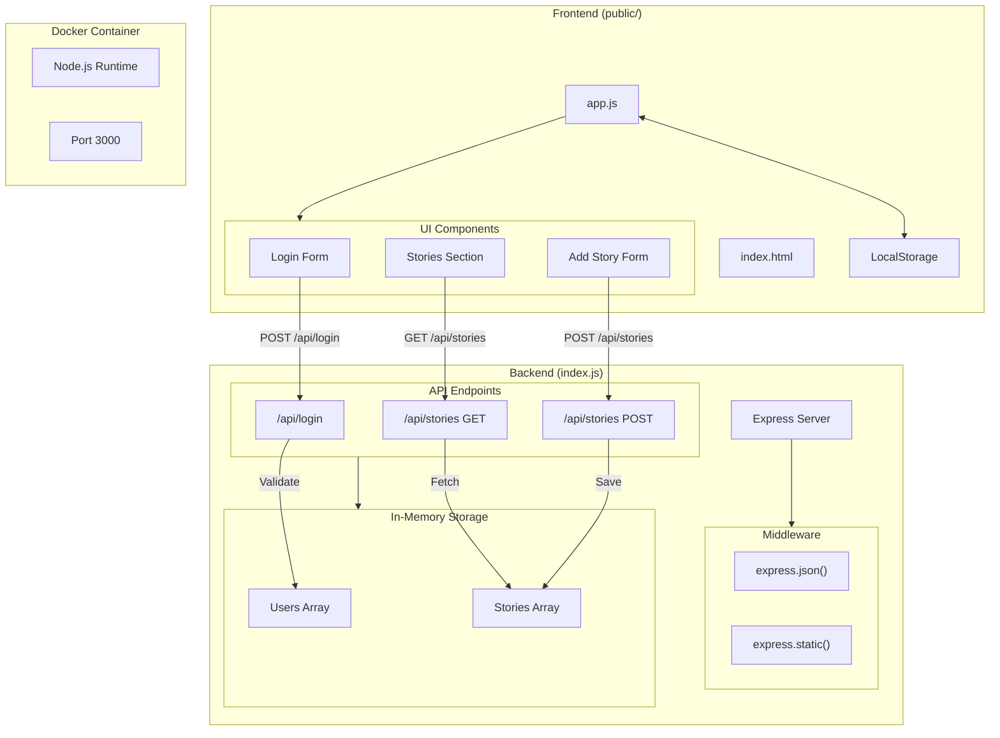

# Application Architecture

This diagram represents the architecture of the my-server application, showing the relationships between frontend components, backend services, and the Docker container.

## Components Description

### Frontend
- **UI Components**: HTML-based user interface with login form, stories section, and story creation form
- **JavaScript Logic**: Handles user interactions, API calls, and local storage management
- **LocalStorage**: Manages user session data

### Backend
- **Express Server**: Node.js server handling HTTP requests
- **Middleware**: Processes JSON requests and serves static files
- **Storage**: In-memory arrays for users and stories
- **API Endpoints**: RESTful endpoints for authentication and story management

### Docker
- **Container**: Isolates the application environment
- **Port Mapping**: Exposes port 3000 for web access

## API Endpoints
1. `POST /api/login` - User authentication
2. `GET /api/stories` - Retrieve all stories
3. `POST /api/stories` - Create a new story 